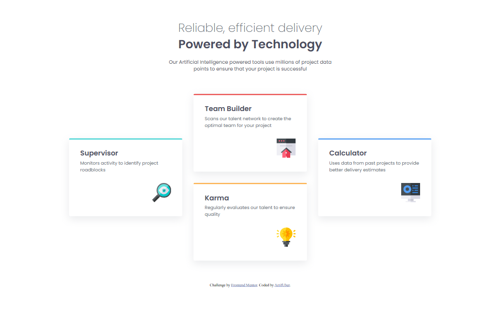

# Frontend Mentor - Four card feature section solution

This is a solution to the [Four card feature section challenge on Frontend Mentor](https://www.frontendmentor.io/challenges/four-card-feature-section-weK1eFYK). Frontend Mentor challenges help you improve your coding skills by building realistic projects.

## Table of contents

- [Overview](#overview)
  - [The challenge](#the-challenge)
  - [Screenshot](#screenshot)
  - [Links](#links)
- [My process](#my-process)
  - [Built with](#built-with)
  - [Useful resources](#useful-resources)
- [Author](#author)

## Overview

### The challenge

Users should be able to:

- View the optimal layout for the site depending on their device's screen size

### Screenshot

### Links

- Solution URL: [solution URL](https://your-solution-url.com)
- Live Site URL: [live site URL](https://your-live-site-url.com)

## My process

### Built with

- Semantic HTML5 markup
- CSS custom properties
- Flexbox
- CSS Grid
- SASS / SCSS

### Useful resources

- [Sass](https://sass-lang.com/) - Documentation about Sass
- [MDN Web Docs](https://developer.mozilla.org/en-US/docs/Web/CSS/flex) - about flex

## Author

- GitHub - [ArrifUber](https://github.com/ArrifUber)
- Frontend Mentor - [@ArrifUber](https://www.frontendmentor.io/profile/ArrifUber)
